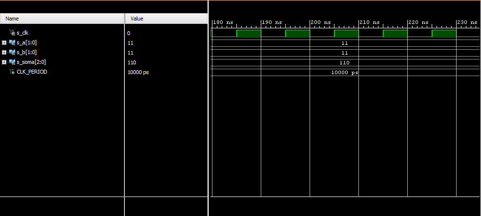
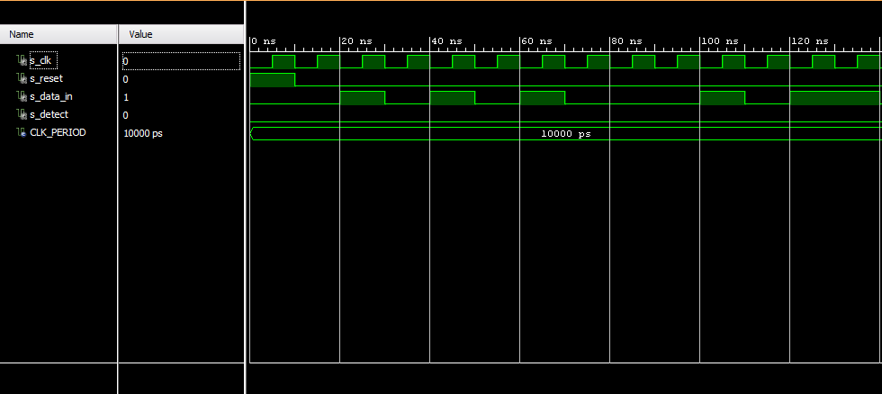
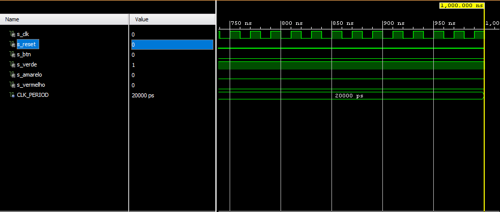

# Projetos de VHDL - Implementação e Verificação

Este repositório contém os três projetos em VHDL desenvolvidos para o trabalho avaliativo de Sistemas Digitais.

---

## Projeto 1: Somador de 2 Bits

### Descrição
Circuito que soma dois números de 2 bits (`a` e `b`), gerando um resultado de 3 bits (`soma`) para acomodar o bit de carry. A operação é sincronizada com o clock.

### Código-Fonte

**Design (somador_2bits.vhd):**
```vhdl
library ieee;
use ieee.std_logic_1164.all;
use ieee.numeric_std.all; 

entity somador_2bits is
    port (
        clk : in  std_logic;
        a   : in  std_logic_vector(1 downto 0);
        b   : in  std_logic_vector(1 downto 0);
        soma: out std_logic_vector(2 downto 0)
    );
end entity somador_2bits;

architecture comportamental of somador_2bits is
begin
    process(clk)
    begin
        if rising_edge(clk) then
            soma <= std_logic_vector(unsigned('0' & a) + unsigned('0' & b));
        end if;
    end process;
end architecture comportamental;
```

**Testbench (tb_somador_2bits.vhd):**
```vhdl
library ieee;
use ieee.std_logic_1164.all;
use ieee.numeric_std.all;

entity tb_somador_2bits is
end entity tb_somador_2bits;

architecture simulacao of tb_somador_2bits is
    component somador_2bits is
        port (
            clk : in  std_logic;
            a   : in  std_logic_vector(1 downto 0);
            b   : in  std_logic_vector(1 downto 0);
            soma: out std_logic_vector(2 downto 0)
        );
    end component;

    signal s_clk : std_logic := '0';
    signal s_a   : std_logic_vector(1 downto 0) := "00";
    signal s_b   : std_logic_vector(1 downto 0) := "00";
    signal s_soma: std_logic_vector(2 downto 0);
    constant CLK_PERIOD : time := 10 ns;

begin
    uut: somador_2bits port map (
        clk  => s_clk,
        a    => s_a,
        b    => s_b,
        soma => s_soma
    );

    clk_process: process
    begin
        s_clk <= '0';
        wait for CLK_PERIOD / 2;
        s_clk <= '1';
        wait for CLK_PERIOD / 2;
    end process clk_process;

    stimulus_process: process
    begin
        wait for CLK_PERIOD;
        
        for i in 0 to 3 loop
            for j in 0 to 3 loop
                s_a <= std_logic_vector(to_unsigned(i, 2));
                s_b <= std_logic_vector(to_unsigned(j, 2));
                wait for CLK_PERIOD;
            end loop;
        end loop;
        wait;
    end process stimulus_process;
end architecture simulacao;
```

### Resultado da Simulação


A simulação mostra todas as 16 combinações possíveis de entrada (0+0 até 3+3) e seus respectivos resultados.

---

## Projeto 2: Detector de Sequência "10110"

### Descrição
FSM do tipo Moore que detecta a sequência "10110" em um fluxo serial de bits. A saída `detect` é ativada em '1' apenas quando a sequência completa é reconhecida. Após a detecção, a FSM retorna ao estado inicial.

### Diagrama de Estados
```
S_IDLE → S1 (recebeu '1')
S1 → S2 (recebeu '0')
S2 → S3 (recebeu '1')
S3 → S4 (recebeu '1')
S4 → S_DETECT (recebeu '0')
S_DETECT → S_IDLE
```

### Código-Fonte

**Design (detector_sequencia.vhd):**
```vhdl
library ieee;
use ieee.std_logic_1164.all;

entity detector_sequencia is
    port (
        clk   : in  std_logic;
        reset : in  std_logic;
        data_in : in  std_logic;
        detect  : out std_logic
    );
end entity detector_sequencia;

architecture fsm of detector_sequencia is
    type state_type is (S_IDLE, S1, S2, S3, S4, S_DETECT);
    signal current_state, next_state : state_type;
begin
    process (current_state, data_in)
    begin
        case current_state is
            when S_IDLE =>
                if data_in = '1' then
                    next_state <= S1;
                else
                    next_state <= S_IDLE;
                end if;

            when S1 => 
                if data_in = '0' then
                    next_state <= S2;
                else
                    next_state <= S1;
                end if;

            when S2 => 
                if data_in = '1' then
                    next_state <= S3;
                else
                    next_state <= S_IDLE;
                end if;

            when S3 => 
                if data_in = '1' then
                    next_state <= S4;
                else
                    next_state <= S2; 
                end if;

            when S4 =>
                if data_in = '0' then
                    next_state <= S_DETECT;
                else
                    next_state <= S1;
                end if;

            when S_DETECT =>
                next_state <= S_IDLE;
        end case;
    end process;

    process (clk, reset)
    begin
        if reset = '1' then
            current_state <= S_IDLE;
        elsif rising_edge(clk) then
            current_state <= next_state;
        end if;
    end process;

    detect <= '1' when current_state = S_DETECT else '0';
end architecture fsm;
```

**Testbench (tb_detector_sequencia.vhd):**
```vhdl
library ieee;
use ieee.std_logic_1164.all;

entity tb_detector_sequencia is
end entity tb_detector_sequencia;

architecture test of tb_detector_sequencia is
    component detector_sequencia is
        port (
            clk   : in  std_logic;
            reset : in  std_logic;
            data_in : in  std_logic;
            detect  : out std_logic
        );
    end component;

    signal s_clk     : std_logic := '0';
    signal s_reset   : std_logic;
    signal s_data_in : std_logic;
    signal s_detect  : std_logic;
    constant CLK_PERIOD : time := 10 ns;

begin
    uut: detector_sequencia
        port map (
            clk     => s_clk,
            reset   => s_reset,
            data_in => s_data_in,
            detect  => s_detect
        );

    s_clk <= not s_clk after CLK_PERIOD / 2;

    stimulus: process
    begin
        s_reset <= '1';
        s_data_in <= '0';
        wait for CLK_PERIOD;
        s_reset <= '0';
        wait for CLK_PERIOD;

        -- Sequência correta: 10110
        s_data_in <= '1'; wait for CLK_PERIOD;
        s_data_in <= '0'; wait for CLK_PERIOD;
        s_data_in <= '1'; wait for CLK_PERIOD;
        s_data_in <= '0'; wait for CLK_PERIOD;
        s_data_in <= '1'; wait for CLK_PERIOD;
        s_data_in <= '0'; wait for CLK_PERIOD;
        
        wait for CLK_PERIOD * 2;

        -- Sequência com erro
        s_data_in <= '1'; wait for CLK_PERIOD; 
        s_data_in <= '0'; wait for CLK_PERIOD; 
        s_data_in <= '1'; wait for CLK_PERIOD; 
        s_data_in <= '1'; wait for CLK_PERIOD; 
        s_data_in <= '0'; wait for CLK_PERIOD; 
        s_data_in <= '1'; wait for CLK_PERIOD; 
        
        wait;
    end process stimulus;
end architecture test;
```

### Resultado da Simulação


A simulação valida a detecção da sequência "10110" e mostra o comportamento correto da FSM em casos de falha.

---

## Projeto 3: Semáforo com Botão de Pedestre

### Descrição
FSM que controla um semáforo de 3 luzes (verde, amarelo, vermelho) com botão de pedestre. 

**Funcionamento:**
- **Ciclo normal:** Verde (5s) → Amarelo (2s) → Vermelho (5s)
- **Com pedestre:** Quando o botão é pressionado durante o verde, após completar o ciclo verde e amarelo, o vermelho permanece por 10 segundos antes de retornar ao verde.

### Diagrama de Estados
```
STATE_GREEN → STATE_YELLOW (após 5s)
  └─ Se botão pressionado: registra pedido

STATE_YELLOW → STATE_RED (após 2s, sem pedido)
STATE_YELLOW → STATE_RED_PED (após 2s, com pedido)

STATE_RED → STATE_GREEN (após 5s)

STATE_RED_PED → STATE_GREEN (após 10s)
  └─ Limpa pedido do pedestre
```

### Código-Fonte

**Design (semaforo.vhd):**
```vhdl
library IEEE;
use IEEE.STD_LOGIC_1164.ALL;
use IEEE.NUMERIC_STD.ALL;

entity semaforo is
    Port ( 
        i_clk         : in  std_logic;
        i_reset       : in  std_logic;
        i_btn_ped     : in  std_logic;
        o_led_verde   : out std_logic;
        o_led_amarelo : out std_logic;
        o_led_vermelho: out std_logic
    );
end semaforo;

architecture Behavioral of semaforo is
    constant CLOCK_FREQ_HZ : natural := 50_000_000;
    constant T_VERDE_S     : natural := 5;
    constant T_AMARELO_S   : natural := 2;
    constant T_VERMELHO_S  : natural := 5;
    constant T_VERMELHO_PED_S : natural := 10;

    constant COUNT_MAX_VERDE    : natural := CLOCK_FREQ_HZ * T_VERDE_S;
    constant COUNT_MAX_AMARELO  : natural := CLOCK_FREQ_HZ * T_AMARELO_S;
    constant COUNT_MAX_VERMELHO : natural := CLOCK_FREQ_HZ * T_VERMELHO_S;
    constant COUNT_MAX_VERMELHO_PED : natural := CLOCK_FREQ_HZ * T_VERMELHO_PED_S;

    type t_state is (STATE_GREEN, STATE_YELLOW, STATE_RED, STATE_RED_PED);
    signal state : t_state;
    signal timer_count  : integer range 0 to COUNT_MAX_VERMELHO_PED;
    signal pedestrian_req : std_logic;

begin
    fsm_process: process(i_clk, i_reset)
    begin
        if i_reset = '1' then
            state          <= STATE_GREEN;
            timer_count    <= 0;
            pedestrian_req <= '0';
            o_led_verde    <= '1';
            o_led_amarelo  <= '0';
            o_led_vermelho <= '0';
            
        elsif rising_edge(i_clk) then
            case state is
                when STATE_GREEN =>
                    o_led_verde    <= '1';
                    o_led_amarelo  <= '0';
                    o_led_vermelho <= '0';

                    if i_btn_ped = '1' then
                        pedestrian_req <= '1';
                    end if;

                    if timer_count = COUNT_MAX_VERDE - 1 then
                        state       <= STATE_YELLOW;
                        timer_count <= 0;
                    else
                        timer_count <= timer_count + 1;
                    end if;

                when STATE_YELLOW =>
                    o_led_verde    <= '0';
                    o_led_amarelo  <= '1';
                    o_led_vermelho <= '0';

                    if timer_count = COUNT_MAX_AMARELO - 1 then
                        if pedestrian_req = '1' then
                            state <= STATE_RED_PED;
                        else
                            state <= STATE_RED;
                        end if;
                        timer_count <= 0;
                    else
                        timer_count <= timer_count + 1;
                    end if;

                when STATE_RED =>
                    o_led_verde    <= '0';
                    o_led_amarelo  <= '0';
                    o_led_vermelho <= '1';
                    
                    if timer_count = COUNT_MAX_VERMELHO - 1 then
                        state       <= STATE_GREEN;
                        timer_count <= 0;
                    else
                        timer_count <= timer_count + 1;
                    end if;
                
                when STATE_RED_PED =>
                    o_led_verde    <= '0';
                    o_led_amarelo  <= '0';
                    o_led_vermelho <= '1';

                    if timer_count = COUNT_MAX_VERMELHO_PED - 1 then
                        state          <= STATE_GREEN;
                        timer_count    <= 0;
                        pedestrian_req <= '0';
                    else
                        timer_count <= timer_count + 1;
                    end if;
            end case;
        end if;
    end process fsm_process;
end Behavioral;
```

**Testbench (tb_semaforo.vhd):**
```vhdl
library IEEE;
use IEEE.STD_LOGIC_1164.ALL;

entity tb_semaforo is
end tb_semaforo;

architecture simulation of tb_semaforo is
    component semaforo
        Port ( 
            i_clk         : in  std_logic;
            i_reset       : in  std_logic;
            i_btn_ped     : in  std_logic;
            o_led_verde   : out std_logic;
            o_led_amarelo : out std_logic;
            o_led_vermelho: out std_logic
        );
    end component;

    signal s_clk   : std_logic := '0';
    signal s_reset : std_logic;
    signal s_btn   : std_logic;
    signal s_verde   : std_logic;
    signal s_amarelo : std_logic;
    signal s_vermelho: std_logic;
    constant CLK_PERIOD : time := 20 ns;

begin
    uut: semaforo
        port map (
            i_clk          => s_clk,
            i_reset        => s_reset,
            i_btn_ped      => s_btn,
            o_led_verde    => s_verde,
            o_led_amarelo  => s_amarelo,
            o_led_vermelho => s_vermelho
        );

    clk_gen_proc: process
    begin
        s_clk <= '0';
        wait for CLK_PERIOD / 2;
        s_clk <= '1';
        wait for CLK_PERIOD / 2;
    end process clk_gen_proc;

    stim_proc: process
    begin
        report "Iniciando simulação";
        s_reset <= '1';
        s_btn   <= '0';
        wait for 100 ns;
        s_reset <= '0';
        wait for CLK_PERIOD;

        -- Teste 1: Ciclo normal
        wait for 13 sec;
        assert (s_verde = '1')
            report "TESTE 1 FALHOU" severity error;

        -- Teste 2: Pedestre
        wait for 2 sec;
        s_btn <= '1';
        wait for 100 ns;
        s_btn <= '0';

        wait for 16 sec;
        assert (s_verde = '1')
            report "TESTE 2 FALHOU" severity error;

        report "Simulação concluída" severity note;
        wait;
    end process stim_proc;
end simulation;
```

### Resultado da Simulação


A simulação mostra o ciclo normal do semáforo e o comportamento modificado após o acionamento do botão de pedestre.

---

## Conclusão

Os três projetos demonstram progressão em complexidade:
1. **Somador**: circuito combinacional básico
2. **Detector**: FSM com detecção de padrão
3. **Semáforo**: FSM com múltiplos estados e temporizadores

Todos os designs foram verificados através de testbenches e simulações que validaram o comportamento esperado.
